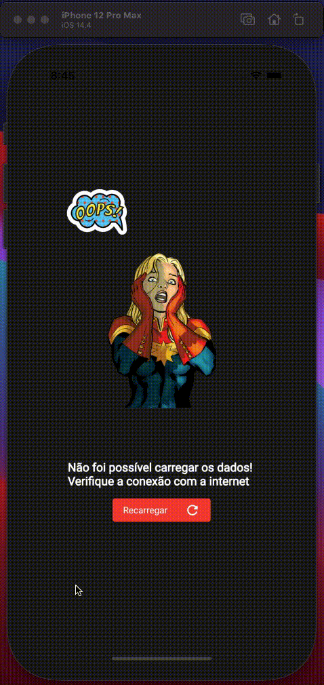

# Marvel App
O projeto consiste em consumir a API da Marvel e apresentar os quadrinhos, com algumas informações.

## Funcionalidades
    - Listar Quadrinhos
    - Ordenar Quadrinhos
    - Listar Detalhes do Quadrinho
    - Redirecionar para loja de quadrinhos no Google Maps

## Exemplo
*Os exemplos a seguir estão sendo rodados em modo debug, para melhor performace o app deve ser rodados em modo profile*

Parte 1

Parte 2

